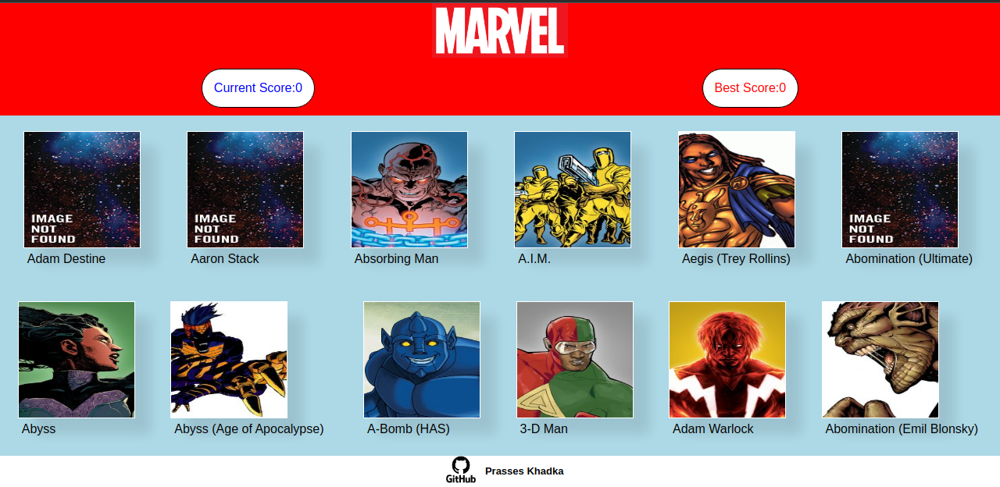

# React-Memory-Card-Game
<h1>Memory Card Game:</h1>
 👉<a href='https://prasseskhadka.github.io/React-Memory-Card-Game/' target='_blank'><i>Live Demo</i></a> 👈

<h1>Preview</h1>
</img>

<h1>Installing and running:</h1>
<ol>
    <li>git clone https://github.com/PrassesKhadka/React-Memory-Card-Game.git</li>
    <li>cd React-Memory-Card-Game</li>
    <li>npm install</li>
    <li>npm run start</li>
</ol>

<h1>Built With:</h1>
<ul>
    <li><a href='https://react.dev/' target="_blank">React</a></li>
    <li><a href='https://styled-components.com/' target="_blank">styled-components</a></li>
    <li><a href='https://developer.marvel.com/' target="_blank">Marvel API</li>
</ul>

<h1>Lessons Learnt:</h1>
<ul>
    <li>Using React <a href='https://www.theodinproject.com/lessons/node-path-javascript-hooks' target="_blank">Hooks</a>(useState and useEffect)</li>
    <li><a href='https://www.theodinproject.com/lessons/node-path-javascript-state-and-props' target="_blank">State Management</a></li>
    <li>Using <a href='https://react.dev/learn/conditional-rendering' target="_blank">Conditional rendering</a></li>
    <li>React <a href='https://styled-components.com/' target="_blank">styled-components</a>->which helps you to write CSS in JS/TS file</li>
    <li>Use of API(Marvel API)</li>
    <li><a href='https://www.theodinproject.com/lessons/javascript-using-git-in-the-real-world' target="_blank">Github</a> branching and workflow</li>
    <li>Use of <a href='https://www.theodinproject.com/lessons/foundations-command-line-basics' target="_blank">command lines</a> in <a href='https://www.theodinproject.com/lessons/foundations-installations' target="_blank">Linux</a> to navigate through files and perform actions</li>
<ul>
  

This Project is a part of <a href='https://www.theodinproject.com/lessons/node-path-javascript-memory-card' target="_blank">The Odin Project</a> JS curiculum
